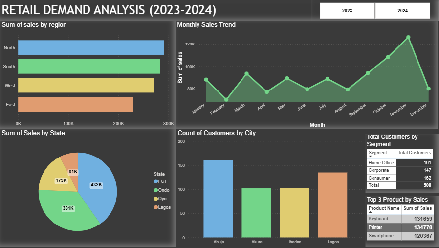

# 🛒 Retail Sales & Demand Analysis

## 📌 Project Overview
This project analyzes retail sales data to uncover customer purchasing patterns, product performance, and sales trends across time, regions, and customer segments. The goal is to provide **data-driven insights** that can support better inventory planning, sales strategy, and business decision-making.

The project is designed as an **end-to-end data analysis workflow**, combining Excel, SQL, Python, and Power BI in a realistic business setting.

---

## 🎯 Business Objectives
- Identify top-performing products and categories by sales and quantity  
- Understand monthly and yearly sales trends  
- Analyze customer segments and regional performance  
- Support inventory and demand planning through historical analysis  

---

## 🗂️ Dataset Description
The dataset consists of **three relational tables**:

### 1. Orders Table
Transactional sales data including:
- `order_date`
- `product_id`
- `customer_id`
- `quantity`
- `sales`
- `region`
- `store_type`

### 2. Products Table
Product-level information:
- `product_name`
- `category`
- `sub_category`
- `cost_price`
- `reorder_level`

### 3. Customers Table
Customer information:
- `customer_name`
- `segment`
- `city`
- `state`
- `country`

> The dataset spans **two years (2023–2024)** and simulates realistic retail operations. It was generated using ChatGpt Artificial Intelligence. 

---

## 🛠️ Tools & Technologies Used
- **Excel** – Data cleaning, validation, pivot-table analysis  
- **SQL** – Data querying, joins, aggregation, trend analysis  
- **Python** – Exploratory Data Analysis (pandas, matplotlib)  
- **Power BI** – Interactive dashboards and business storytelling  

---

## 🔍 Key Analysis Performed

### 📊 Sales Performance Analysis
- Identified **top 3 products by total sales**  
- Analyzed category and sub-category performance  
- Compared sales across regions and store types  

### 📈 Time-Based Trend Analysis
- Monthly and yearly sales trends  
- Demand patterns for top-selling products  
- Moving average smoothing for noise reduction  

### 👥 Customer & Regional Insights
- Sales contribution by customer segment  
- Regional sales distribution  
- Online vs physical store performance  

---

## 📈 Demand Trend Interpretation (Top Product)

The monthly demand for the top-selling product shows **significant short-term fluctuations**, with noticeable spikes and drops across different months. This indicates that customer purchasing behavior is not constant and may be influenced by factors such as promotions, stock availability, or seasonal buying habits.

To better understand the underlying pattern, a **3-month moving average** was applied. While the actual demand appears highly volatile, the smoothed trend reveals a **relatively stable underlying demand pattern**. A temporary slowdown is visible around the middle of the period, followed by a recovery toward the later months.

Overall, there is **no strong long-term upward or downward trend**, suggesting that demand for this product remains generally stable over time.

### Business Implication
Although raw monthly demand is volatile, the smoothed trend indicates that this product is **suitable for trend-based inventory planning**. Management should avoid reacting to short-term spikes or drops and instead base replenishment decisions on the underlying demand trend to reduce the risk of overstocking or stockouts.

---

## 📊 Power BI DashboardThe Power BI report includes:- Sales overview KPIs (Total Sales, Quantity, Orders)  - Monthly sales trends  - Top products and categories  - Regional and customer segment analysis  - Business insights and recommendations  

---

## 📸 Project Visuals

### Monthly Demand Trend (Python)

### Moving Average Analysis

### Power BI Dashboard

---

## 🚀 Next Steps (Planned Enhancements)
- Implement **demand forecasting** for top-selling products  
- Compare actual vs predicted demand  
- Apply machine learning for product and customer segmentation  
- Add forecast-driven inventory recommendations  

> These enhancements will transition the project from **data analysis** to **data science**.

---

## 👤 Author
**Ayodeji**  
Aspiring Data Analyst / Data Scientist  

- **Skills:** Python | SQL | Power BI | Excel  
- **GitHub:** https://github.com/Deji-Codes  
- **LinkedIn:** https://www.linkedin.com/in/abdul-haleem-ayodeji-044a82310  

---
